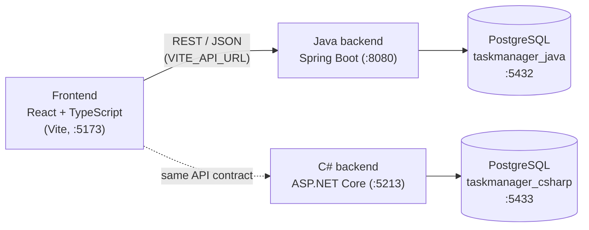

# Task Manager

[](https://github.com/GiadaFerrario/task-manager/actions/workflows/backend-java.yml)
[](https://github.com/GiadaFerrario/task-manager/actions/workflows/backend-csharp.yml)
[](https://github.com/GiadaFerrario/task-manager/actions/workflows/frontend.yml)

A full-stack task manager: a React single-page app talking to a REST API that is implemented **twice**, in Java (Spring Boot) and in C# (ASP.NET Core), on top of PostgreSQL. This monorepo contains the frontend and both backends.

## What the app does

- Create, edit and delete **categories**: a name, a description and a color picked from a palette. Deleting a category keeps its tasks, without a category.
- Create **tasks** with a title, a description, an optional priority (low / medium / high) and an optional category. New tasks start as *To do*.
- Open a task to change its description, status (*To do* / *In progress* / *Done*), priority and category, or to delete it.
- Change the status or the priority of a task straight from its card by clicking the chip.
- See the totals of tasks and categories on the home page, with shortcuts to create new ones.

## Tech stack

| Layer | Technologies |
|---|---|
| Frontend | React 19, TypeScript, Vite, Material UI, React Router, Axios, Storybook |
| Backend (Java) | Java 21, Spring Boot 3 (Web, Data JPA, Security, Validation), Flyway, Lombok, Maven |
| Backend (C#) | C# 12, ASP.NET Core 8 (minimal APIs), Entity Framework Core, Npgsql, EF Core migrations |
| Database | PostgreSQL 16 (one database per backend), Docker Compose |
| Testing | JUnit 5, Mockito, MockMvc (Java); xUnit, `WebApplicationFactory` (C#); Testcontainers for both |
| CI | GitHub Actions |

## Architecture



The frontend talks to **one** backend at a time: the base URL is the `VITE_API_URL` environment variable (the Java backend by default). Both backends implement the same [API contract](#api-contract) and each one owns its own database, so they never interfere with each other.

**Frontend** (`frontend/src`): `pages/` (one component per route), `components/` (cards, forms and dialogs, chips, lists, all documented in Storybook), `api/` (Axios services and error handling), `models/` (TypeScript types and enum labels). State is local to the pages (React hooks), without a global store, which is enough for this scope.

**Java backend** follows the usual layered Spring architecture:

```text
controller  ->  service  ->  repository (Spring Data JPA)  ->  PostgreSQL
   DTO records       business rules        entities (Flyway owns the schema)
```

A `GlobalExceptionHandler` turns exceptions into a uniform JSON error and `SecurityConfig` defines the (public) security rules and CORS.

**C# backend** is deliberately lighter: endpoint groups (`Endpoints/`) use the EF Core `AppDbContext` directly, with DTO records in `Dtos/` and EF Core migrations in `Migrations/`. There is no service or repository layer because the logic is small and EF Core's `DbContext` already acts as a unit of work.

## Why two backends

Java is the stack I know best, so I built the Java backend first. I then rewrote the same API in **C# and ASP.NET Core** to learn something new and step out of my comfort zone: starting from a project I already understood let me focus on the platform instead of the domain.

Keeping the API contract identical turned out to be a good constraint. The frontend only depends on the contract, not on the framework behind it, so both backends can be tested against the same expectations and compared side by side:

| | Java / Spring Boot | C# / ASP.NET Core |
|---|---|---|
| Structure | Layers: controller, service, repository | Minimal API endpoints on `DbContext` |
| Schema | SQL migrations with Flyway (SQL is the source of truth) | Code-first EF Core migrations (the model is the source of truth) |
| Validation | Bean Validation (`@Valid`) plus service checks | Explicit checks in the endpoints |
| Enums | `@Enumerated(STRING)` | `HasConversion<string>()` plus a JSON converter for `UPPER_SNAKE_CASE` |
| Configuration | `application.properties` and environment variables | `appsettings.json`, user secrets and environment variables |
| Integration tests | `@SpringBootTest` + MockMvc | `WebApplicationFactory` + `HttpClient` |

Writing the C# integration tests against the same contract also exposed real differences between the two implementations (for example how an invalid enum value or the deletion of a category with tasks was handled), which I fixed so the backends are now interchangeable: the frontend works unchanged with either one.

## Structure

```text
task-manager/
├── api/               # OpenAPI contract shared by the two backends
├── frontend/          # Frontend application
├── backend-java/      # Java backend
└── backend-csharp/    # ASP.NET Core backend
```

## Projects

### Frontend

Located in [`frontend/`](./frontend).

React + TypeScript single-page app (Vite, Material UI, Storybook) to manage tasks and categories.

### Java Backend

Located in [`backend-java/`](./backend-java).

Spring Boot REST API with Spring Data JPA, Flyway migrations and PostgreSQL.

### C# Backend

Located in [`backend-csharp/`](./backend-csharp).

ASP.NET Core Web API using Entity Framework Core and PostgreSQL.

## Repository

This repository consolidates the history of the original frontend and backend repositories into a single monorepo.

## Quick start

The frontend works with either backend (same API contract). Prerequisites: Docker, Node 20+, and JDK 21 (Java backend) or .NET 8 SDK (C# backend).

**1. Database** (from the repo root)

```bash
cp .env.example .env      # set your own credentials; .env is git-ignored
docker compose up -d --wait
```

**2. Backend** (pick one)

```bash
# Java: http://localhost:8080
cd backend-java
set -a; source ../.env; set +a      # exports POSTGRES_USER / POSTGRES_PASSWORD
./mvnw spring-boot:run
```

```bash
# C#: http://localhost:5213 (Swagger UI at /swagger)
cd backend-csharp
dotnet user-secrets set "ConnectionStrings:Default" \
  "Host=localhost;Port=5433;Database=taskmanager_csharp;Username=<POSTGRES_USER>;Password=<POSTGRES_PASSWORD>" \
  --project task-tracker.csproj                      # first time only
ASPNETCORE_ENVIRONMENT=Development dotnet run --project task-tracker.csproj --urls http://localhost:5213
```

**3. Frontend** (http://localhost:5173)

```bash
cd frontend
npm install
npm run dev
```

It calls the Java backend by default. For the C# backend, create `frontend/.env.local` with `VITE_API_URL=http://localhost:5213/api`.

See each project's README for details (tests, migrations, configuration).

## API contract

Both backends expose the same REST API under `/api`, so the frontend works with either of them. The contract is written down in [`api/openapi.yaml`](./api/openapi.yaml) (OpenAPI 3.1), and each backend is tested against that file (see [Tests](#tests)).

| Method | Path | Description |
|---|---|---|
| GET / POST | `/tasks` | List / create a task (always created as `TODO`) |
| GET / PUT / DELETE | `/tasks/{id}` | Read / replace / delete a task |
| PATCH | `/tasks/{id}/status?status=` | Change the status |
| PATCH | `/tasks/{id}/priority?priority=` | Change the priority |
| PATCH | `/tasks/{id}/category?categoryId=` | Change the category |
| GET / POST | `/categories` | List / create a category |
| PUT / DELETE | `/categories/{id}` | Update / delete a category (its tasks are kept, without category) |
| GET | `/statuses`, `/priorities` | Enum values as `{ "name", "label" }` |

Shared conventions:
- Enums are `UPPER_SNAKE_CASE` strings: status `TODO` / `IN_PROGRESS` / `DONE`, priority `LOW` / `MEDIUM` / `HIGH`. Priority and category are optional (`null`).
- A task includes its category as `categoryId`, `categoryName` and `categoryColor`.
- `PUT /tasks/{id}` and `PUT /categories/{id}` replace the resource: a missing priority, category or description is cleared.
- Errors have the same body: `{ "status", "error", "message", "path" }`. Invalid input (blank title or name, unknown enum value) is a `400`; an unknown task or category is a `404`.

## Tests

Backend tests run the real application on a throwaway PostgreSQL started by **Testcontainers**, so Docker must be running (the databases of the Quick start are not touched).

```bash
cd backend-java && ./mvnw test                    # JUnit 5, Mockito, MockMvc
cd backend-csharp && dotnet test TaskTracker.sln  # xUnit, WebApplicationFactory
```

Both suites check the same contract (see above), which keeps the two backends interchangeable.

**Contract tests**: `OpenApiContractTest` (Java) and `OpenApiContractTests` (C#) run the same scenario through the API and validate **every response** (status code and JSON body) against [`api/openapi.yaml`](./api/openapi.yaml). They also fail if the contract documents a response the scenario never exercises, so the file and the two implementations cannot drift apart. The CI runs them whenever `api/` changes.

## Continuous integration

GitHub Actions (`.github/workflows/`) runs one workflow per project on every pull request and on pushes to `main`, only when files of that project change:

| Workflow | Steps |
|---|---|
| `backend-java.yml` | JDK 21, `./mvnw verify` (build + all tests, with Testcontainers) |
| `backend-csharp.yml` | .NET 8, restore, build (Release), `dotnet test` (with Testcontainers) |
| `frontend.yml` | Node 22, `npm ci`, `npm run lint`, `npm run build` (type check + bundle) |

## Databases
Both backends use PostgreSQL 16, each with its own database running in a separate Docker container.

| Backend | Container | Host port | Database |
|---|---|---|---|
| Java | `postgres-java` | 5432 | `taskmanager_java` |
| C# | `postgres-csharp` | 5433 | `taskmanager_csharp` |

To reset a database, remove its volume:
`docker compose down -v` (both) or `docker compose rm -sf postgres-java && docker volume rm task-manager_pgdata_java`.

## License

Released under the [MIT License](./LICENSE).
